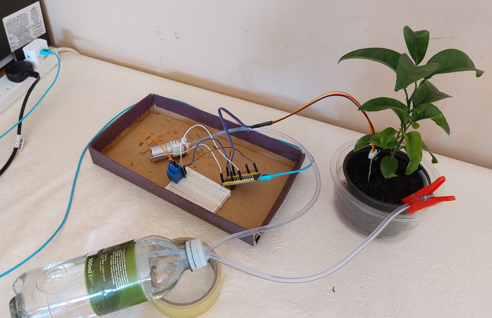
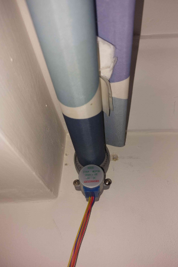

# 🔌 Smart Home Arduino Projects

A collection of compact **IoT and automation projects** developed by **Sultan Rasul** using **ESP32** and **Arduino**.  
These projects demonstrate practical embedded systems design — connecting sensors, actuators, and cloud platforms to automate real-world tasks in the home.  

Each system focuses on reliability, low-cost hardware, and cloud integration through services like **Arduino IoT Cloud** and **SinricPro**, blending software logic with physical control.

## 📂 Projects

### 🌱 Smart Plant Watering System
- Automatically monitors soil moisture and controls a water pump.
- Built with **Arduino IoT Cloud**, **ESP32**, and a **capacitive soil sensor**.
- Supports both **manual** and **automatic** watering modes via IoT Dashboard.
- Includes live telemetry for soil moisture and pump status.

📁 Code: [`/smart-plant-watering`](./smart-plant-watering)

---

### 🪟 Motorised Blinds Controller
- Cloud-controlled blinds using **ESP32**, **SinricPro**, and a **stepper motor**.
- Synchronises position with a backend API and supports Alexa/Google Home integration.
- Communicates via Wi-Fi and updates step position to a remote server.

📁 Code: [`/motorised-blinds`](./motorised-blinds)

  
[▶ Watch Demo Video](./motorised-blinds/MotorisedBlinds.mp4)

---

## 🧰 Tech Used
| Category | Tools & Frameworks |
|-----------|-------------------|
| Hardware | ESP32, Relays, Stepper Motor |
| Cloud Platforms | Arduino IoT Cloud, SinricPro |
| Networking | Wi-Fi, HTTP, JSON APIs |
| Languages | C / C++ (Arduino) |
| IDEs | Arduino IDE, VS Code |

---

## ⚙️ Setup
Each project folder includes:
- `.ino` file (main code)
- Wiring notes or diagrams (if available)
- Minimal configuration for Wi-Fi credentials and API keys
